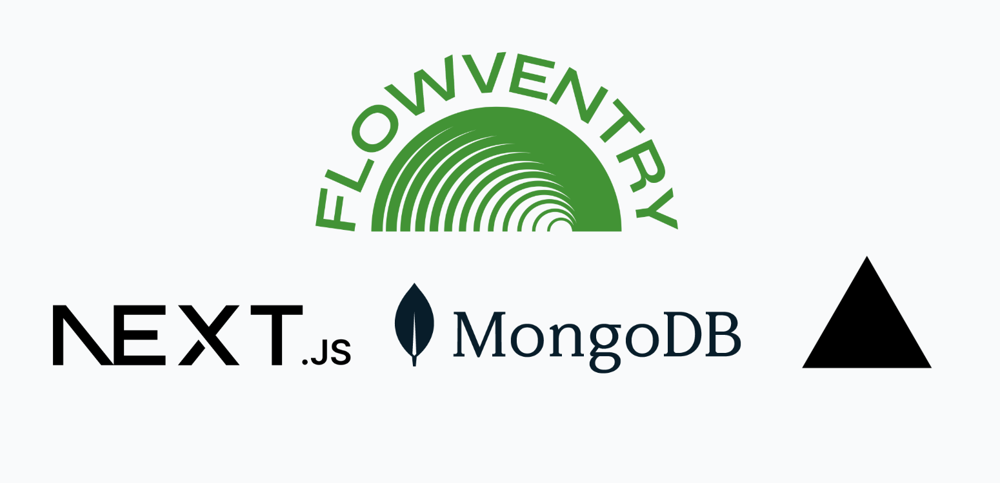

# FlowVentry - Inventory Management (Next.js + MongoDB)



FlowVentry is a minimal, full‑stack inventory app built with Next.js App Router, MongoDB Atlas, and modern UI patterns. Deployed on Vercel, it isdesigned to efficiently manage, track, and organize a business’s inventory to monitor stock levels, manage product details, and generate reports to make informed decisions.

## Features

- Add, list, and update products (CRUD).
- Live search using MongoDB text indexes.
- Instant quantity +/− with UI revalidation.
- Clean, responsive UI with sticky table headers and zebra rows.
- Modular Next.js API routes with clean JSON contracts.

## Tech Stack

- Next.js (App Router), React, Tailwind CSS  
- MongoDB Atlas, MongoDB Node.js Driver  
- Vercel (deployment), GitHub (CI/CD)


## API Endpoints

- GET /api/product — list all products  
- POST /api/product — add a product  
  - body: { name: string, quantity: number, price: number }
- GET /api/search?query=... — text search (name/quantity/price)  
- POST /api/update — increment/decrement quantity  
  - body: { action: "plus" | "minus", name: string, initialQuantity: number }


## Data Model

```json
{
  "name": "T‑Shirt (Black)",
  "quantity": 10,
  "price": 15
}
```

Text index (for demo search):
```js
db.inventory.createIndex({ name: "text", quantity: "text", price: "text" })
```

## Deployment

- Push to GitHub; connect repo to Vercel.  
- Set MONGODB_URI and MONGODB_DB in Vercel Project Settings.  
- Vercel handles builds and previews; promote to production from dashboard.
